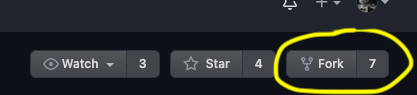

## Cats, Cats, Everywhere

Throughout this workshop, you will be using a Spring Boot application called _Cat Service_ that returns cat names and ages. The app uses a postgres database to store cat information.

#### Prerequisites

You will need:
- A GitHub [account](https://github.com)
- A GitHub [personal access token](https://github.com/settings/tokens) with *repo* and *workflow* access rights

## GitHub repo setup

### Fork the GitHub repos

Click on the following GitHub links and use the GitHub UI to fork the following repos:


> Note: If you've done this workshop before and already have forks, delete and recreate them now.
> You can delete a repo on GitHub: click on `Settings` and scroll to the bottom of the page; it is the last option in the box titled "Danger Zone."

**1. cat-service** - app source code
```dashboard:open-url
url: https://github.com/booternetes-III-springonetour-july-2021/cat-service
```

**2. cat-service-release-ops** - app & database deployment files
```dashboard:open-url
url: https://github.com/booternetes-III-springonetour-july-2021/cat-service-release-ops
```

### Set the default branch

For each of the two repos, navigate to `Settings-->Branches` and click on the two arrows on the right of the screen to switch the default branch. Set the default to `educates-workshop`.


> Make sure to update the default branch for both repositories.

### Set your GitHub org

It's easier to auto-generate commands in this tutorial if you store the name of your GitHub org in an environment variable (hint: the org is the bit before the repo name on your newly forked repos; often the same as your username).
> Don't worry—the value will not be saved or used outside your tutorial session, and you do not need to provide your password.

Run the following command.
At the prompt, enter your GitHub org name.
```execute-1
printf "Enter your GitHub org and press enter/return: " && read GITHUB_ORG
```

### Clone the repos

Clone your repos to the workshop environment.
```execute-1
rm -rf cat-*

git clone https://github.com/$GITHUB_ORG/cat-service && \
    cd cat-service && \
    cd ..

git clone https://github.com/$GITHUB_ORG/cat-service-release-ops && \
    cd cat-service-release-ops && \
    cd ..
```

You should now see two new directories in the workshop.
Check out the contents.
```execute-1
tree -L 1 cat*
```

The output will show:
```
cat-service
├── bin
├── bump
├── mvnw
├── mvnw.cmd
├── pom.xml
├── README.md
└── src
cat-service-release-ops
├── manifests
├── README.md
```

As you can see, `cat-service` has the structure of a typical Spring Boot application, and `cat-service-release-ops` contains the manifests for deploying to Kubernetes.
