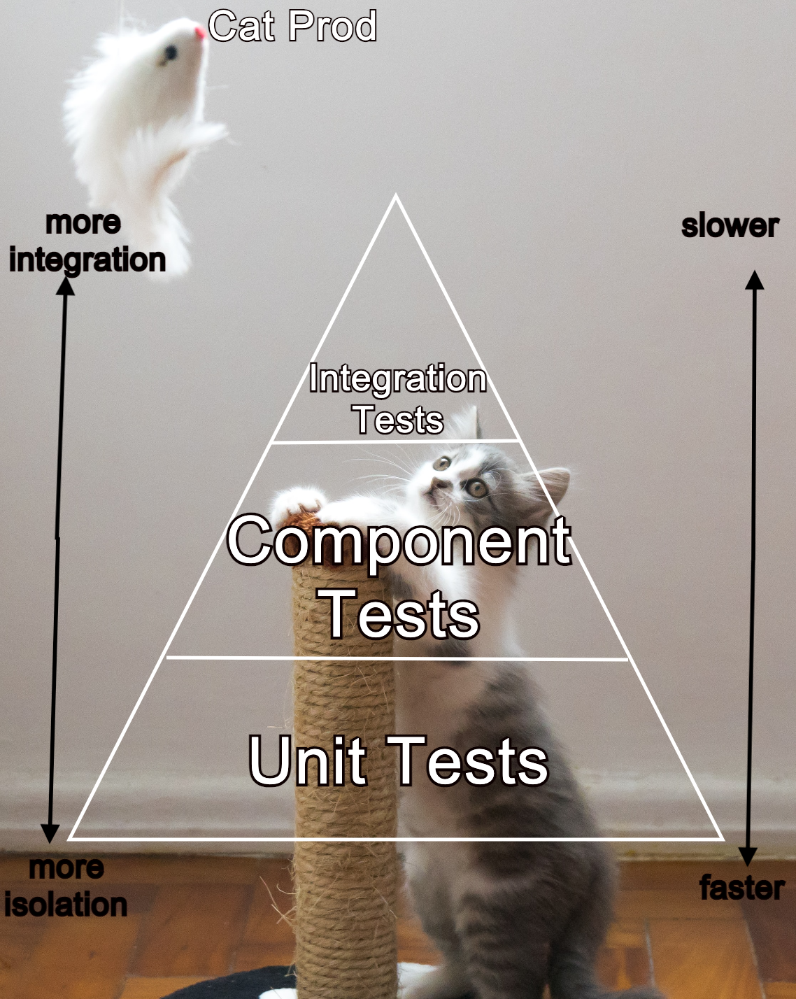

## Testing makes purr-fect

We definitely want this Cats application meowing in production.
Let's go through the rigamarole of testing to ensure that what we coded is indeed
the behaviour that will be exhibited during production and any future
version[N] -> version[N+1] rollouts.



<font size="1"> background photo by Willian Justen de Vasconcellos on Unsplash</font> 
### Test pyramids with Jupiter

JUnit5, also known as Jupiter, will facilitate our test bed—the bottom of the test pyramid—and allow us to surface some useful behavioural tests. If you are already used to Junit4, then don't bite your nails just yet—JUnit5 is quite similar up front. The most visible difference being namespace changes from `org.junit.test` to `org.junit.jupiter.test`. There are some architectural changes to Junit5; if you are curious about those, check out [the docs](https://junit.org/junit5/docs/current/user-guide/) to get further in depth. 

First, we will add a test to determine if a Cat can be created without error. That is, we don't want our constructor
or constructor-like method to throw `Exception`. Thus, annotate the method under test with the `@Test` annotation, 
and provide assertion logic per our application spec.

To see this in context, click below:

```editor:select-matching-text
file: ~/cat-service/src/test/java/com/example/demo/CatTests.java
text: "void createCatWithValidNameShouldSucceed() {"
before: 1
after: 2
```

The next couple of tests describe negative result behaviour. Since we have a 'Cat' entity under test that has specific requirements on input: `Names must start with a capital letter and be at least 2 letters in length`. The following Junit5 assertions can be used to ensure this behaviour.

See this in context:

```editor:select-matching-text
file: ~/cat-service/src/test/java/com/example/demo/CatTests.java
text: "void createCatWithShortNameShouldThrowException() {"
before: 1
after: 7
```

So far, nothing too complex is happening and that's good; cats like to keep things simple. Other than basic state tests, the Cat manages a `LocalDate` internally, and any methods that use it must go under test as well. We want to ensure that Cat state remains consistent across method calls, and that 
`LocalDateObject` is properly utilized. We can do that by testing out methods which make use of `LocalDateObject`'s manipulation methods such as `getAgeInMonths()`, `minusMonths()`, `now()`, and so on...


Click to see this in context:

```editor:select-matching-text
file: ~/cat-service/src/test/java/com/example/demo/CatTests.java
text: "void getNameShouldReturnName() {"
before: 1
after: 15
```

And that's it! Cats aren't easy to please, but are *fur*ious testers. In the next section, we move on up the test pyramid to component and integration testing of the persistence and web layers.