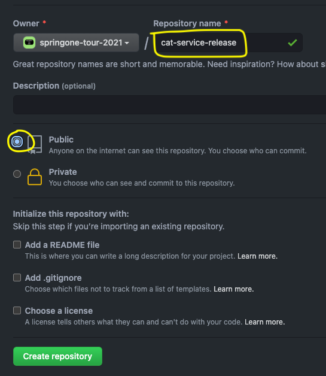
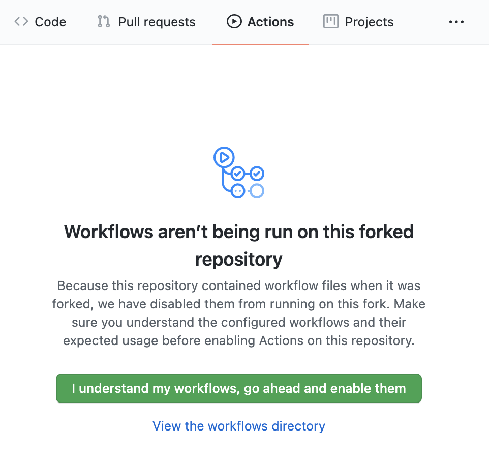
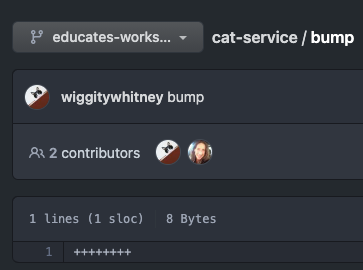
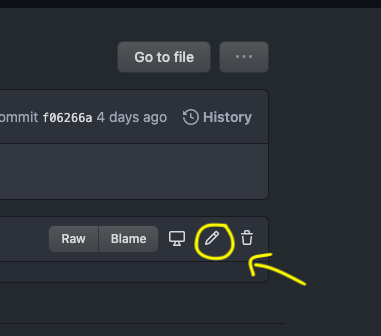
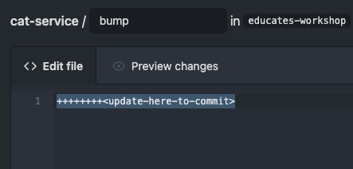
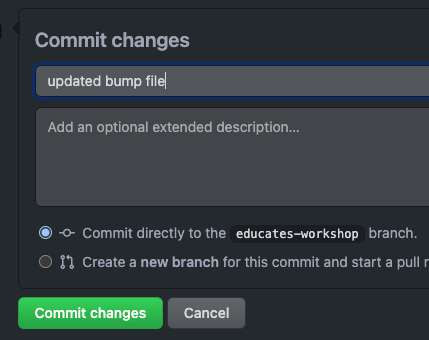
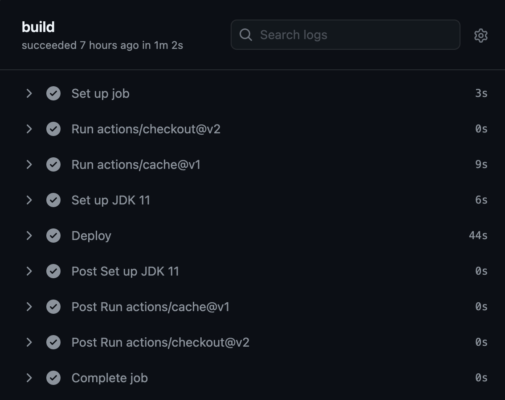

In the previous exercises you ran the tests manually, but this is not optimal. The next step is to have an automated workflow. One way is with [GitHub Actions](https://docs.github.com/en/actions). 

GitHub Actions are used to automate your development workflow. They can be triggered on any GitHub event such as creating a pull request or a new commit. It has CI/CD and can be used to build, test, and deploy your code from GitHub.

### GitHub Actions workflow

There are some key tasks to automate:
- Testing
- Ensuring the app builds
- Container builds (You could use `spring-boot:build-image`, but you will do it with a more specialized tool in the next exercise.)

Triggering `mvn clean build` on a git commit would do all of these tasks. However, we do not want to build containers if the tests fail. We need a way to decouple these parts of the workflow. 

This can be done in different ways. We're first going to use `mvn clean deploy` to test and ensure the app builds. Then we are choosing to copy (via a forced git push) the code into a separate repository, `cat-service-release`. Presumably this release repository could have more limited write access than cat-service (e.g. only pipeline system account can write to it). And then the container will be built. We will see the container building part in the next section.

Click on the following link to get to your GitHub and use the UI to create a new repository called `cat-service-release` (this link works if your signed in).

```dashboard:open-url
url: https://github.com/new
```
Make sure that your repo is `public` so that GitHub actions can work. Please match the following settings including the naming the repo `cat-service-release`.

#### Deployment script
Now take a look at the deployment script. This script calls `mvn clean verify`, initializes the `cat-service-release` as a git respository, and pushes the code if and only if `mvn clean verify` passes. 
```editor:open-file
file: ~/cat-service/.github/workflows/deploy.sh 
```

This first part of the script sets the `user.email` and `user.name` to set the Author as `Booternetes CI Bot` and the email as `<>` in the commit. 
```editor:select-matching-text
file: ~/cat-service/.github/workflows/deploy.sh
text: "user.name"
before: 1
```

It then does a `mvn clean verify` to test the code. On success it creates some directories and for clones the upstream `booternetes-III-springonetour-july-2021/cat-service-release` repository from GitHub. It then moves out the `.git` directory out to preserve it. The contents are cleared and the code from `cat-service` is then copied over and the `.git` director is moved back. Lastly a branch is created and it's pushed up to your `cat-service-release` repository.
```editor:select-matching-text
file: ~/cat-service/.github/workflows/deploy.sh
text: "promote_code()"
after: 11
```

#### GitHub Actions workflow file
Now take a look at the YAML workflow file. You'll be storing your GitHub username and access token in the next step. 

The `on` section is what the `job` section gets triggered by. Here we have it triggered on pushes or pull requests to the main branch. 
```editor:select-matching-text
file: ~/cat-service/.github/workflows/deploy.yaml
text: "on"
after: 5
```

The `jobs` section executes all the tasks triggered by `on`.
```editor:select-matching-text
file: ~/cat-service/.github/workflows/deploy.yaml
text: "jobs"
after: 22
```

The action `checkout@v2` checks-out your repo so your workflow can access it.
```editor:select-matching-text
file: ~/cat-service/.github/workflows/deploy.yaml
text: "checkout@v2"
```

The next action `cache@v1` caches everything from your maven repository `~/.m2` to speed up subsequent builds.
```editor:select-matching-text
file: ~/cat-service/.github/workflows/deploy.yaml
text: "cache@v1"
```

To set the workflow to use JDK 11 with the action use `actions/setup-java@v1`:
```editor:select-matching-text
file: ~/cat-service/.github/workflows/deploy.yaml
text: "actions/setup-java@v1"
```

To `run:` is used to run the `deploy.sh` script that we just looked at.
```editor:select-matching-text
file: ~/cat-service/.github/workflows/deploy.yaml
text: "run"
```

### GitHub Actions secrets

The last configuration detail to set up is to add credentials to `cat-service` so that the GitHub Actions in `cat-service` can push a copy of the tested code to `cat-service-release`. 

Create a GitHub [personal access token](https://github.com/settings/tokens). It needs "repo" and "workflow" access rights.

Run this command and click on the link in terminal 1 to get to the `cat-service` repository's secrets
```execute-1
echo https://github.com/$GITHUB_ORG/cat-service/settings/secrets/actions
```
Create a new repository secret called `GIT_USERNAME` with your GitHub username as the value
Create another secret called `GIT_PASSWORD` with your access token as the value

## Enable GitHub Actions

Run this command and click on the link in terminal 1 navigate to the `cat-service` repository's actions page:
```execute-1
echo https://github.com/$GITHUB_ORG/cat-service/actions
```

Click on the button to enable GitHub Actions workflows.


### Try it out

Take a look at the contents of `cat-service-release`. It will be empty.
Run this command and click on the link in terminal 1
```execute-1
echo https://github.com/$GITHUB_ORG/cat-service-release
```

#### Commit and push a change
We are going to manually push to the `cat-service` repository to trigger the GitHub Actions workflow to push the tested code to `cat-service-release`.
> We will be doing this through the Github UI to avoid asking for your password, otherwise it is common to trigger this after pushing code to GitHub as part of the development process.

Within the `cat-service` repo make a change to the file `bump` 

Reach your the file `cat-service/bump` in your repo by clicking the next command to get a link in terminal-1.
```execute-1
echo https://github.com/$GITHUB_ORG/cat-service/blob/educates-workshop/bump
```

When you get to that file it will look like this:


Click the edit button on the right hand side of the window, it's a pencil icon.


Now, you can alter this file so you can commit to this repo, you can add another `+` sign if you wish.


Commit your changes in the UI at the bottom of this page like so.


Now check out the logs by clicking on the Action's name and then build. You'll see a log for setting up the job, running through each of the actions in the workflow file, post logs, and completing the job. Click on any of them to check out the logs.
Run this command and click on the link in terminal 1:
```execute-1
echo https://github.com/$GITHUB_ORG/cat-service/actions
```



#### Check contents of cat-service-release

Once the action workflow is done, check the `cat-service-release` repository again.You should now see pushed code!
Run this command and click on the link in terminal 1:
```execute-1
echo https://github.com/$GITHUB_ORG/cat-service-release
```
