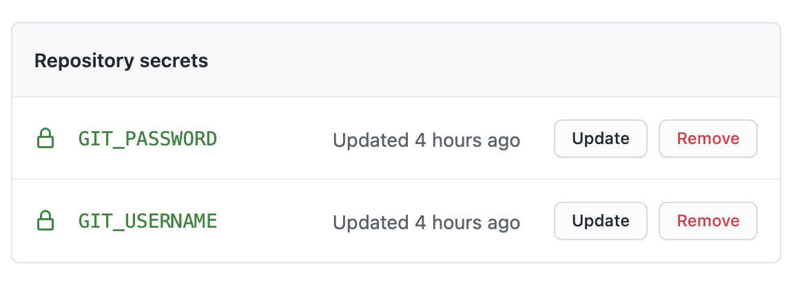

In the previous exercises you ran the tests manually, but this is not optimal. Instead, we want to establish an automated testing workflow. 

One way to achieve this is with [GitHub Actions](https://docs.github.com/en/actions). 
GitHub Actions can be used to build, test, and/or deploy your code. They can be configured as a series of pre-defined actions or they can execute a shell script that you provide. They can be triggered on any GitHub event, including pull requests, commits, webhook events, and more. Best of all, they are built right into GitHub, so you don't need to install or manage any additional software in order to use them—just pop a couple of additional files into your app repo and you're off to the races!

## Objective

Our objective in this exercise is two-fold:
1. Automate all the testing in the previous sections.
We can accomplish this by running `mvn verify`, as this goal includes both unit tests and integration tests.
2. Trigger the next step in the workflow. 

This can be done in a few different ways. For this workshop, we've chosen to "force push" the tested code to a separate GitHub repo called `cat-service-release`. A commit to this "release" repo can serve as a trigger for the next step in the workflow.

## Prerequisite: release repository

Start by creating the "release" repository that will house the tested code.
This repository must exist in order for GitHub Actions to push code to it.

You can use the following link to get to the right page on GitHub for creating a new repo.
Name the repo `cat-service-release` and make sure you set the visibility to `public`.
```dashboard:open-url
url: https://github.com/new
```


## GitHub Actions workflow file

GitHub Actions are defined by placing workflow YAML files in a directory in your repo called `.github/workflows`.

Take a look at the workflow definition file in your `cat-service` repository.

The `on` section lists the kinds of events that will trigger the `job`.
```editor:select-matching-text
file: ~/cat-service/.github/workflows/deploy.yaml
text: "on"
after: 4
```

The `jobs` section defines the tasks that it will run.
```editor:select-matching-text
file: ~/cat-service/.github/workflows/deploy.yaml
text: "jobs"
after: 22
```

The action `checkout@v2` checks-out your repo so your workflow can access it.
```editor:select-matching-text
file: ~/cat-service/.github/workflows/deploy.yaml
text: "actions/checkout@v2"
```

The action `cache@v1` caches your maven repository `~/.m2` to speed up subsequent builds.
```editor:select-matching-text
file: ~/cat-service/.github/workflows/deploy.yaml
text: "actions/cache@v1"
```

The action `actions/setup-java@v1` provides a JDK for building and testing the app:
```editor:select-matching-text
file: ~/cat-service/.github/workflows/deploy.yaml
text: "actions/setup-java@v1"
```

The final step executes a custom script that we have provided called `deploy.sh`.
We will walk through this script momentarily.
```editor:select-matching-text
file: ~/cat-service/.github/workflows/deploy.yaml
text: "run:"
after: 2
```

#### Deployment script

Take a look at the `deploy.sh` script.
Don't [have too many kittens about it](https://idioms.thefreedictionary.com/having+kittens)—it's simpler than it looks.
The last line is the heart of the script:
```editor:select-matching-text
file: ~/cat-service/.github/workflows/deploy.sh
text: 'mvn clean verify && promote_code'
```

`mvn clean verify` will run unit and integration tests.
If this operation succeeds, the code is good to go and can be pushed to the `cat-service-release` repository.
The `promote_code` function does just that, and the `&&` between the two command ensures that `promote_code` will be executed if and only if `mvn clean verify` passes.

Don't let the entrails of the `promote_code` function (defined in the same file) distract you. They are not germaine to the topic at hand. It is merely some .git folder manipulation to achieve the push to `cat-service-release`.

#### GitHub Actions secrets

Notice there are several environment variables in the `deploy.sh` script.
The variables that start with GITHUB are provided by default.
However, there are two additional, non-default variables.
```editor:select-matching-text
file: ~/cat-service/.github/workflows/deploy.sh
text: '${GIT_USERNAME}:${GIT_PASSWORD}'
```

These two variables are needed in order to push code to the release repository. Note, however, that:
- The values must be set on GitHub (not in the tutorial editor), protected under your GitHub account as GitHub `Secrets`.
- You need to use a GitHub [personal access tokens](https://github.com/settings/tokens), not your account password. Make sure that your token has *repo* and *workflow* access rights.

Run this command and click on the link in terminal 1 to get to the `cat-service` repository's secrets.
```execute-1
echo https://github.com/$GITHUB_ORG/cat-service/settings/secrets/actions
```
Create the two repository secrets:
- `GIT_USERNAME` - with your GitHub username as the value
- `GIT_PASSWORD` - with your GitHub access token as the value



> A thought on access control:
> Ideally, all developers on the Cats team would have write access to `cat-service`, but only the automation toolchain—in this case, GitHub Actions—would have write access to `cat-service-release`. 
> This would ensure that the release code has passed testing, and it would protect it from accidental or nefarious commits to the production release.

## Try it out

#### Enable GitHub Actions

Because your repo is a fork, GitHub Actions are initially disabled.
Enable them now by clicking on the Actions section of the repo on GitHub.
You can use the link generated by this command to get to the right page.
```execute-1
echo https://github.com/$GITHUB_ORG/cat-service/actions
```

Click on the button to enable GitHub Actions workflows.


#### Commit and push a change

Now, remember, in our ideal scenario described above, as a developer you only have access to `cat-service`. Go ahead and make a commit to `cat-service` now.

Navigate to the `cat-service` repository on GitHub.
Open the file called `bump`. 
You can use the following action to generate a link to the right page.
```execute-1
echo https://github.com/$GITHUB_ORG/cat-service/blob/educates-workshop/bump
```

When you get to that file it will look like this:


Click the edit button on the right hand side of the window (it's a pencil icon).


Edit this file any way you like. Adding or deleting a single character is enough.


Scroll to the bottom and commit your changes.


Now check out the logs by clicking on the Action's name, and then on "build." You'll see a log for setting up the job, running through each of the actions in the workflow file, post logs, and completing the job. Click on any of them to check out the logs.
Run this command and click on the link in terminal 1:
```execute-1
echo https://github.com/$GITHUB_ORG/cat-service/actions
```


#### Check contents of cat-service-release

Once the action workflow is done, check the `cat-service-release` repository again. You should now see pushed code!
Run this command and click on the link in terminal 1:
```execute-1
echo https://github.com/$GITHUB_ORG/cat-service-release
```
