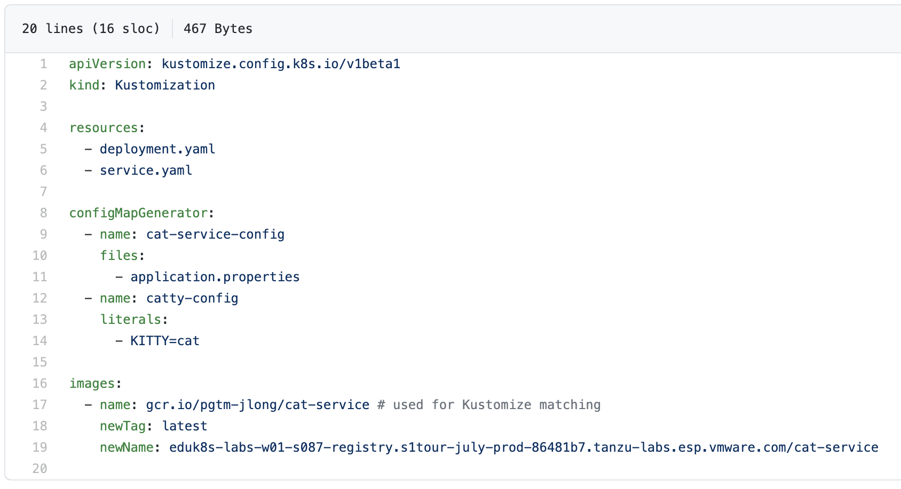

You could automate deployment by adding `kubectl apply -k...` to your automation scripts using Github Actions, Jenkins, or any similar toolchain.

However, there is another tool that provides a more robust set of features for managing deployments at scale and over time. This tool is called [Argo CD](https://argo-cd.readthedocs.io/en/stable).

In this exercise, you will use `Argo CD` to automate the deployment of `Cat Service` and ensure that the deployment stays true to the manifests.

## Review Argo CD installation

Argo CD has already been installed into the workshop cluster.

_Interested in the installation instructions? Read  [this](https://argo-cd.readthedocs.io/en/stable/getting_started)._

List the Custom Resource Definitions (CRDs) that Argo CD has added to your cluster.
```execute-1
kubectl api-resources | grep argo
```

Shortly, you will create "Application" resources.

## Log in to Argo CD

Argo CD has a UI as well as a CLI.

#### Argo CD CLI

Log in using the CLI first.

First, start a port-forward.
Do this in terminal 2 and leave it running for the remainder of this exercise.
```execute-2
kubectl port-forward svc/argocd-server -n argocd 8080:80
```

Next, run this command to store the password in an environment variable.
```execute-1
ARGOCD_PW=$(kubectl get secret argocd-initial-admin-secret -n argocd -o jsonpath="{.data.password}" | base64 -d)
```

To see some available commands, run `argocd --help`, or simply:
```execute-1
argocd
```

Log in through the CLI.
```execute-1
argocd login localhost:8080 --username admin --password=$ARGOCD_PW --insecure --plaintext
```

#### Argo CD Web UI

Open the Argo CD UI.
```dashboard:open-url
url: http://{{workshop_namespace}}-argocd.{{ingress_domain}}/applications?namespace={{session_namespace}}
```

Log in as `admin`.
To retrieve the password, run:
```execute-1
echo $ARGOCD_PW
```

Click around if you'd like.
You'll come back to the UI shortly.

## Deploy dev Cat Service 

There are several ways to configure an application in Argo CD.
You can use the UI, the CLI, or you can use `kubectl` to apply a manifest describing the Argo CD application resource.
In this exercise, you will use the CLI.

#### Update registry host
Before continuing, you will need to update the `newName` field in `manifests/base/app/kustomization.yaml` on GitHub, as Argo CD will be using the remote copy of the file.
You can navigate to the file on GitHub or run this command and click on the link in terminal 1:
```execute-1
echo https://github.com/${GITHUB_ORG}/cat-service-release-ops/blob/educates-workshop/manifests/base/app/kustomization.yaml
```
Click on the pencil icon to edit.
Make sure `newName` matches the "Repository" value in your registry.
To get the value, run:
```execute-1
echo $REGISTRY_HOST
```

While you're here, add another `configMapGenerator` after `cat-service-config` using the following snippet.
You will use it later in this exercise.
```
  - name: catty-config
    literals:
      - KITTY=cat
```

The result should look something like this:


Click "Commit changes" at the bottom of the page to save the changes.

#### Create the dev application

Create an Argo CD `application` for the dev deployment.
Notice that you are instructing Argo CD to poll the `educates-workshop` branch of the cat-service-release-ops repository on GitHub for any changes to `manifests/overlays/dev` (and any relevant base files).
```execute-1
argocd app create dev-cat-service-${SESSION_NAMESPACE} \
                  --label session=${SESSION_NAMESPACE} \
                  --dest-namespace ${SESSION_NAMESPACE} \
                  --dest-server https://kubernetes.default.svc \
                  --repo https://github.com/${GITHUB_ORG}/cat-service-release-ops.git \
                  --revision educates-workshop \
                  --path manifests/overlays/dev
```

## Check the results

The following instructions will guide you using the CLI.
Feel free to switch to the UI and apply the same concepts.

#### App sync

Check the status of the Argo CD application.
```execute-1
argocd app list --selector session=${SESSION_NAMESPACE}
```

Your results should show that the application is `OutOfSync`.
```
NAME                                  CLUSTER                         NAMESPACE             PROJECT  STATUS     HEALTH   SYNCPOLICY  CONDITIONS  REPO                                                       PATH                    TARGETdev-cat-service-eduk8s-labs-w14-s008  https://kubernetes.default.svc  eduk8s-labs-w14-s008  default  OutOfSync  Missing  <none>      <none>      https://github.com/ciberkleid/cat-service-release-ops.git  manifests/overlays/dev  educates-workshop
```

Check the resources in your Kubernetes namespace.
You should not see any Cat Service resources.
```execute-1
kubectl get all
```

You might have expected Argo CD to immediately apply the manifests, since they clearly do not match what is running in the cluster. 
However, by default, Argo CD notifies you that the cluster is `OutOfSync` but it does not automatically apply the manifests.
You can 'sync' the application using the UI or the CLI each time Argo CD reports it is out of sync, or you can enable auto-sync so that Argo CD continues to do so automatically.

Enable auto-sync.
```execute-1
argocd app set dev-cat-service-${SESSION_NAMESPACE} --sync-policy automated
```

Run the commands above again, to check the app status and Kubernetes resources.
You can also use the UI.
Notice that Argo CD immediately applied the manifests, and is reporting on the health of the resources.

Your Kubernetes output should look something like this.
```
NAME                                      READY   STATUS      RESTARTS   AGE
pod/cat-service-build-1-w4kp6-build-pod   0/1     Completed   0          18m
pod/dev-cat-postgres-5c488f4cbc-7hvfz     1/1     Running     0          4m14s
pod/dev-cat-service-79c687969-722c6       1/1     Running     0          57s

NAME                       TYPE        CLUSTER-IP       EXTERNAL-IP   PORT(S)          AGE
service/dev-cat-postgres   NodePort    10.104.136.123   <none>        5432:30582/TCP   4m14s
service/dev-cat-service    ClusterIP   10.97.214.254    <none>        8080/TCP         4m14s

NAME                               READY   UP-TO-DATE   AVAILABLE   AGE
deployment.apps/dev-cat-postgres   1/1     1            1           4m14s
deployment.apps/dev-cat-service    1/1     1            1           4m14s

NAME                                          DESIRED   CURRENT   READY   AGE
replicaset.apps/dev-cat-postgres-5c488f4cbc   1         1         1       4m14s
replicaset.apps/dev-cat-service-575b766458    0         0         0       4m14s
replicaset.apps/dev-cat-service-79c687969     1         1         1       57s
```

#### App prune

Check for ConfigMaps in your Kubernetes namespace.
```execute-1
kubectl get cm
```

Your output will be similar to this.
```
NAME                                DATA   AGE
dev-cat-service-config-mh6774bg29   1      5m47s
dev-catty-config-fk62ft2f9k         1      35s
kube-root-ca.crt                    1      176m
```

Return to GitHub, and delete the configMapGenerator for catty-config. 
Save the change and check Argo CD status again.
```execute-1
argocd app list --selector session=${SESSION_NAMESPACE}
```

It may take a few minutes for Argo CD to poll the repo.
Once it does, you should see the status is OutOfSync.
You should also see that the configMap is not deleted from the cluster.

Why is this?

Deleting live resources that have been removed from the manifests is called `pruning`.
Argo CD does not prune resources by default.

You can prune manually anytime Argo CD alerts you about the discrepancy, or you can enable automatic pruning.
Use the CLI or the UI to prune catty-config.
```execute-1
argocd app sync dev-cat-service-${SESSION_NAMESPACE} --prune 
```

Check the app status and the configMaps in Kubernetes again.
You should see the application is synced and catty-config is gone.

#### Auto-heal

Kubernetes manages a lot of self-healing.
If you delete a pod, for example, the associated Kubernetes deployment will ensure a new pod is created.

However, what happens if you delete a deployment? Kubernetes will accept the action as intentional, and it will not recreate it.

Let's say a critical situation arises and your Operations team determines that the best course of action is to manually change a resource in the production cluster. This buys the team time to investigate the root cause and find a long term solution.

In the case, would you want Argo CD to automatically sync the application, immediately overriding your emergency actions? Probably not. Hence, automatic `self-healing` is also disabled by default.

Give it a try.
Run the following command to manually delete the dev deployment.
```execute-1
kubectl delete deployment dev-cat-service
```

Again, get the app status and check Kubernetes resources.

You should see the following output.
```
~$ argocd app list --selector session=${SESSION_NAMESPACE}
NAME                                  CLUSTER                         NAMESPACE             PROJECT  STATUS     HEALTH   SYNCPOLICY  CONDITIONS  REPO                                                       PATH                    TARGET
dev-cat-service-eduk8s-labs-w14-s008  https://kubernetes.default.svc  eduk8s-labs-w14-s008  default  OutOfSync  Missing  Auto        <none>      https://github.com/ciberkleid/cat-service-release-ops.git  manifests/overlays/dev  educates-workshop
```
and
```
~$ kubectl get all
NAME                                      READY   STATUS      RESTARTS   AGE
pod/cat-service-build-1-w4kp6-build-pod   0/1     Completed   0          134m
pod/dev-cat-postgres-5c488f4cbc-rxvgp     1/1     Running     0          36m

NAME                       TYPE        CLUSTER-IP       EXTERNAL-IP   PORT(S)          AGE
service/dev-cat-postgres   NodePort    10.106.137.28    <none>        5432:31916/TCP   36m
service/dev-cat-service    ClusterIP   10.111.101.236   <none>        8080/TCP         36m

NAME                               READY   UP-TO-DATE   AVAILABLE   AGE
deployment.apps/dev-cat-postgres   1/1     1            1           36m

NAME                                          DESIRED   CURRENT   READY   AGE
replicaset.apps/dev-cat-postgres-5c488f4cbc   1         1         1       36m
```

You can sync the app manually as needed using:
```execute-1
argocd app sync dev-cat-service-${SESSION_NAMESPACE}
```
You can also enable automatic self-healing.
```execute-1
argocd app set dev-cat-service-${SESSION_NAMESPACE} --self-heal
```

> Note: You can read more about Argo CD sync policies [here](https://argoproj.github.io/argo-cd/user-guide/auto_sync/).

## Deploy to prod

As an exercise, you can repeat these steps using the prod overlay.

Here is an app creation command that enables auto-sync and pruning from the outset.
```execute-1
argocd app create prod-cat-service-${SESSION_NAMESPACE} \
                  --label session=${SESSION_NAMESPACE} \
                  --dest-namespace ${SESSION_NAMESPACE} \
                  --dest-server https://kubernetes.default.svc \
                  --repo https://github.com/${GITHUB_ORG}/cat-service-release-ops.git \
                  --revision educates-workshop \
                  --path manifests/overlays/prod \
                  --sync-policy automated \
                  --auto-prune                  
```

## Next Steps

In the next exercise, you will create the final link so that Argo CD applies new app images created by kpack.
